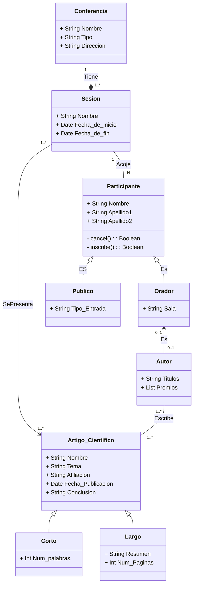

# Diagrama y código
Elabora un documento en markdown que incluya lo siguiente:

1) Breve descripción del proceso realizado.

2) Código fuente del diagrama anotado en sus etiquetas.

3) Código java de las clases.

## Breve descripción del proceso realizado
Tras la lectura de las caracteristicas a implementar y la consideración de los diversos tipos de relaciones a tratar, añadir, recubrir y unir las diferentes tablas, asegurándose de usar las conexiones correctas para reflejar dichas relaciones.

A la hora de recubrir, dividir los atributos de las operaciones a su vez que se indican los tipos de datos en estos primeros. La visibilidad se marcará en ambos.

Posteriormente, incorporar las cordinaliades necesarias en el esquema.

## Diagrama


## Código java de las clases
```java
import java.util.Date;
import java.util.List;

public abstract class Conferencia {
    public String nombre;
    public String tipo;
    public String direccion;
    public Conferencia(String nombre, String tipo, String direccion) {
        this.nombre = nombre;
        this.tipo = tipo;
        this.direccion = direccion;
    }
    public String getNombre() {
        return nombre;
    }
    public void setNombre(String nombre) {
        this.nombre = nombre;
    }
    public String getTipo(){
        return tipo;
    }
    public void setTipo(String tipo){
        this.tipo = tipo;
    }
    public String getDireccion() {
        return direccion;
    }
    public void setDireccion(String direccion) {
        this.direccion = direccion;
    }
}

public class Sesion {
    public String nombre;
    public Date fecha_de_inicio;
    public Date fecha_de_fin;
    public Sesion(String nombre, Date fecha_de_inicio, Date fecha_de_fin) {
        this.nombre = nombre;
        this.fecha_de_inicio = fecha_de_inicio;
        this.fecha_de_fin = fecha_de_fin;
    }
    public String getNombre() {
        return nombre;
    }
    public void setNombre(String nombre) {
        this.nombre = nombre;
    }
    public Date getFecha_de_inicio(){
        return fecha_de_inicio;
    }
    public void setFecha_de_inicio(Date fecha_de_inicio){
        this.fecha_de_inicio = fecha_de_inicio;
    }
    public Date getFecha_de_fin(){
        return fecha_de_fin;
    }
    public void setFecha_de_fin(Date fecha_de_fin){
        this.fecha_de_fin = fecha_de_fin;
    }
}

public class Participante {
    public String nombre;
    public String apellido1;
    public String apellido2;
    private Boolean cancel_status;
    private Boolean inscription_status;

    public Participante(String nombre, String apellido1, String apellido2, Boolean cancel_status, Boolean inscription_status) {
        this.nombre = nombre;
        this.apellido1 = apellido1;
        this.apellido2 = apellido2;
        this.cancel_status = cancel_status;
        this.inscription_status = inscription_status;
    }

    public String getNombre() {
        return nombre;
    }
    public void setNombre(String nombre) {
        this.nombre = nombre;
    }
    public String getApellido1() {
        return apellido1;
    }
    public void setApellido1(String nombre) {
        this.apellido1 = apellido1;
    }
    public String getApellido2() {
        return apellido2;
    }
    public void setApellido2(String nombre) {
        this.apellido2 = apellido2;
    }
    private Boolean getCancel_status(){
        return cancel_status;
    }
    private void setCancel_status(Boolean cancel_status){
        this.cancel_status = cancel_status;
    }
    private Boolean getInscription_status(){
        return inscription_status;
    }
    private void setInscription_status(Boolean inscription_status){
        this.inscription_status = inscription_status;
    }
}

public class Publico extends Participante {
    public String tipo_Entrada;

    public Publico(String tipo_Entrada, String nombre, String apellido1, String apellido2, Boolean cancel_status, Boolean inscription_status){
        super(nombre, apellido1, apellido2, cancel_status, inscription_status);
        this.tipo_Entrada = tipo_Entrada;
    }

    public String getTipo_Entrada() {
        return tipo_Entrada;
    }
    public void setTipo_Entrada(String tipo_Entrada) {
        this.tipo_Entrada = tipo_Entrada;
    }
}

public class Orador extends Participante {
    public String sala;

    public Orador(String tipo_Entrada, String nombre, String apellido1, String apellido2, Boolean cancel_status, Boolean inscription_status){
        super(nombre, apellido1, apellido2, cancel_status, inscription_status);
        this.sala = tipo_Entrada;
    }

    public String getSala(){
        return sala;
    }
    public void setSala(){
        this.sala = sala;
    }
}

public class Autor(){
    String titulos;
    List<String> premios;

    public String getTitulos(){
        return titulos;
    }
    public void setTitulos(String titulos){
        this.titulos = titulos;
    }
    public List<String> getPremios(){
        return premios;
    }
    public void setPremios(List<String> premios){
        this.premios = premios;
    }
}

public class Artigo_Cientifico {
    String nombre;
    String tema;
    String afiliacion;
    Date fecha_Publicacion;
    String conclusion;
    public Artigo_Cientifico(String nombre, String tema, String afiliacion, Date fecha_Publicacion, String conclusion) {
        this.nombre = nombre;
        this.tema = tema;
        this.afiliacion = afiliacion;
        this.fecha_Publicacion = fecha_Publicacion;
        this.conclusion = conclusion;
    }
    public String getNombre() {
        return nombre;
    }
    public void setNombre(String nombre) {
        this.nombre = nombre;
    }
    public String getTema() {
        return tema;
    }
    public void setTema(String tema) {
        this.tema = this.tema;
    }
    public String getAfiliacion(){
        return afiliacion;
    }
    public void setAfiliacion(String afiliacion){
        this.afiliacion = afiliacion;
    }
    public Date getFecha_Publicacion(){
        return fecha_Publicacion;
    }
    public void setFecha_Publicacion(Date fecha_Publicacion){
        this.fecha_Publicacion = fecha_Publicacion;
    }
    public String getConclusion(){
        return conclusion;
    }
    public void setConclusion(){
        this.conclusion = conclusion;
    }
}

public class ArtigoCientifico_Corto extends Artigo_Cientifico {
    int num_palabras;

    public ArtigoCientifico_Corto(int num_palabras, String nombre, String tema, String afiliacion, Date fecha_Publicacion, String conclusion) {
        super(nombre, tema, afiliacion, fecha_Publicacion, conclusion);
        this.num_palabras = num_palabras;
    }
    public int getNum_palabras(){
        return num_palabras;
    }
    public void setNum_palabras(int num_palabras){
        this.num_palabras = num_palabras;
    }
}

public class ArtigoCientifico_Largo extends Artigo_Cientifico {
    String resumen;
    int num_paginas;

    public ArtigoCientifico_Largo(String resumen, int num_paginas, String nombre, String tema, String afiliacion, Date fecha_Publicacion, String conclusion) {
        super(nombre, tema, afiliacion, fecha_Publicacion, conclusion);
        this.resumen = resumen;
        this.num_paginas = num_paginas;
    }
    public String getResumen(){
        return resumen;
    }
    public void setResumen(String resumen){
        this.resumen = resumen;
    }
    public int getNum_paginas(){
        return num_paginas;
    }
    public void setNum_paginas(int num_paginas){
        this.num_paginas = num_paginas;
    }
}
```